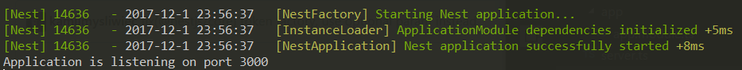
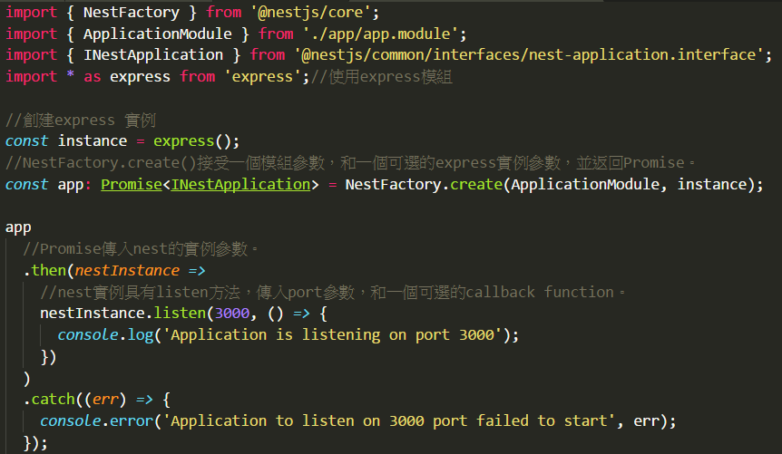
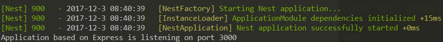

# Nest.js framework 30天初探:Day01 攻略行前說明

## 筆者廢話時間
[NodeJS](https://nodejs.org/en/) 後端框架眾多，唯獨[Nestjs](https://nestjs.com/) 這框架最吸引我，雖然今年三月底出爐，還算蠻新的框架，網路上資源不多，但我相信日後它會有一席之地，因為我在努力推廣XDDDD，阿不是，是因為它架構嚴謹，能寫出高品質的程式。


## 前言
JavaScript係弱型別語言，型態轉換很自由，型態檢查也沒那麼嚴謹，這可搞死很多工程師，近幾年雖然有ES6、ES7、ES8的出現(ES9正在擬稿)，可以幫助工程師提高程式品質，但跟強型別語言還是有些差距，於是出現了[TypeScript](https://www.typescriptlang.org/)，可以用[TypeScript](https://www.typescriptlang.org/)寫出強型別風格的程式碼，再透過[Babel](https://babeljs.io/)轉換成指定版本的JavaScript([ECMAScript版本](https://en.wikipedia.org/wiki/ECMAScript))。

[Nestjs](https://nestjs.com/)的官網建議使用[TypeScript](https://www.typescriptlang.org/)，後續的示範都會以[TypeScript](https://www.typescriptlang.org/)去撰寫，如果要寫一般JavaScript也是可行的，不過官網有提到，有些[Nestjs](https://nestjs.com/)的API無法用JavaScript去呼叫使用，所以使用[TypeScript](https://www.typescriptlang.org/)作為開發語言會比較好。

## Nestjs Framework幾個特點:
1. Base On [Express](http://expressjs.com/) 框架和[socket.io](https://socket.io/)套件。
2. 語法風格類似[Angular](https://angular.io/)，也有人覺得類似[Java Spring](https://spring.io/)，使用了許多裝飾器語法。
3. [依賴注入(Dependency Injection)](https://zh.wikipedia.org/wiki/%E4%BE%9D%E8%B5%96%E6%B3%A8%E5%85%A5)，[Nestjs](https://nestjs.com/)大量使用[依賴注入](https://docs.nestjs.com/fundamentals/dependency-injection)，建議使用此作法。
4. [Exception layer](https://docs.nestjs.com/exception-filters)，可以做更多的exception處理。
5. [Guards](https://docs.nestjs.com/guards)作為路由警衛，處理訪問權限。
6. [Interceptors](https://docs.nestjs.com/interceptors)攔截器機制。
7. [Unit Test](https://docs.nestjs.com/fundamentals/unit-testing) & [E2E Test](https://docs.nestjs.com/fundamentals/e2e-testing)。

基於上述幾個特點，[Nestjs](https://nestjs.com/)做了很多抽象層，程式如果是用[Nestjs](https://nestjs.com/)開發，會較接近低藕合架構，甚至開發速度也會有大幅提升;另一方面，[Nestjs](https://nestjs.com/)的底層是Express框架，在使用[Nestjs](https://nestjs.com/)開發時，也可以呼叫[Express的API](https://docs.nestjs.com/controllers)，而且[Express](http://expressjs.com/)作為最多人使用的NodeJS後端框架，是有潛力吸收廣大使用[Express](http://expressjs.com/)開發的工程師，建立龐大活躍的社群。

## 筆者30天規劃
* 基礎介紹篇(10天):了解[Modules](https://docs.nestjs.com/modules)、[Controllers](https://docs.nestjs.com/controllers)、[Components](https://docs.nestjs.com/components)、等框架的核心API。
* [Webscoket](https://developer.mozilla.org/zh-TW/docs/WebSockets/WebSockets_reference/WebSocket)運用篇(3天):[Nestjs](https://nestjs.com/)對於[Websocket](https://developer.mozilla.org/zh-TW/docs/WebSockets/WebSockets_reference/WebSocket)有一些處理[更細緻的API](https://docs.nestjs.com/websockets/gateways)可以使用。
* [MicroServices](https://zh.wikipedia.org/zh-tw/%E5%BE%AE%E6%9C%8D%E5%8B%99)運用篇(2天):了解[Nestjs](https://nestjs.com/)如何建立[MicroServices](https://docs.nestjs.com/microservices/basics)。
* 資料庫操作篇(3天):介紹如何透過[Nestjs](https://nestjs.com/)的API去[串接操作資料庫](https://docs.nestjs.com/recipes/sql-typeorm)。
* 串接第三方API運用篇(3天):介紹如何在[Nestjs](https://nestjs.com/)使用[Passport模組](https://docs.nestjs.com/recipes/passport)、串接[Swagger](https://docs.nestjs.com/recipes/swagger)服務等。
* 會員聊天室實作篇(9天):採[Restful API](https://stackoverflow.com/questions/671118/what-exactly-is-restful-programming)風格，撰寫具備CRUD功能且能即時聊天的小專案。

## 歡迎大家討論指教
筆者文筆拙劣，程式功力薄弱，說明解釋不佳或程式有問題之地方，請不吝指教。

## 準備環境(筆者環境)
* 建議使用Visual Studio Code作為開發工具
* NodeJS version:8.9.1
* npm version:5.5.1

## Nestjs專案準備步驟
1. cmd下指令,安裝[Nestjs CLI工具](https://github.com/nestjs/nest-cli)。
```
npm install -g @nestjs/cli
```
2. cmd下指令，透過[Nestjs CLI工具](https://github.com/nestjs/nest-cli)工具建立一個Nestjs專案。
```
nest new NestStarter
```
3. cmd下指令，切換到安裝資料夾，並安裝相關模組。
```
cd NestStarter & npm install
```
4. 修改index.js，新增引用ts-node/register模組並修改server.ts引用的路徑。
```typescript
require('ts-node/register');
require('./src/server');
```
5. cmd下指令，啟動Server，如有看到下圖即大功告成，預設listen 3000 port。
```
npm start
```


6. 將server.ts的程式碼稍作變化，程式碼及說明如下圖:


7. cmd下指令，如看到下圖，代表我們已經成功啟動一個base on Express的nest 程式。
```
npm start
```
