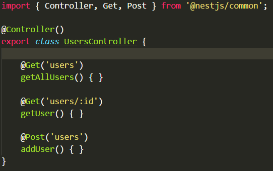
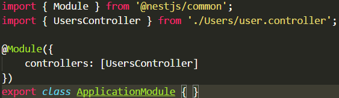
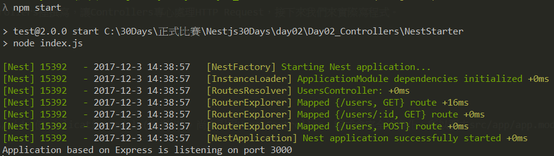
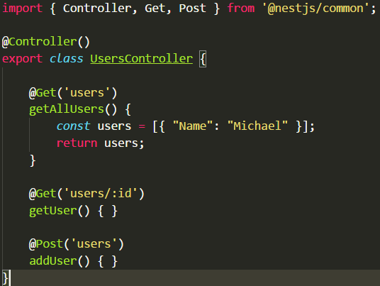
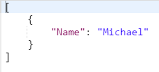

# Nest.js framework 30天初探:Day02 Controllers

## Controllers

主要是接收從Client發出的HTTP Request，Controllers作為路由層，商業邏輯盡量別在Controllers裡撰寫，讓Controllers專心處理HTTP Request，接下來我們來實際寫程式。
1. 在資料夾根目錄，下cmd指令，創建Users資料夾:
```
cd src/app & mkdir Users
```
2. 在src/app/Users，新增users.controller.ts，其程式碼如下:


說明:UsersController是一個帶有裝飾器(Decorator)的類，我們定義好了上述/users、/users/:id，但ApplicationModule(根模組)，尚未引用UsersController，程式會完全沒變化，所以要去src/app/app.module.ts改寫程式碼。

3. 在src/app/app.module.ts，改寫成下圖所示。


說明:如此ApplicationModule就知道有UsersController的存在，程式也會去執行它。

4. 下cmd指令，重啟server，並使用postman觀察http://localhost:3000/users
```
ctrl+C
npm start
```

觀察到Console畫面，UserController有load進去、路徑也有map，且[Postman](https://www.getpostman.com/apps)的結果會得到200狀態碼，代表Controller已經有被運行成功。

5. 向/users發Http GET請求時，回傳點假資料看一下，程式碼修改如下圖。


6. 下cmd指令，重啟server，並使用[Postman](https://www.getpostman.com/apps)觀察http://localhost:3000/users
```
ctrl+C
npm start
```


結果符合預期。

7. 在每個裝飾器都寫路徑似乎很麻煩，我們可以直接在Controller傳入路徑前綴，程式碼修改如下圖。


程式碼精簡許多，適合寫Restful API。
